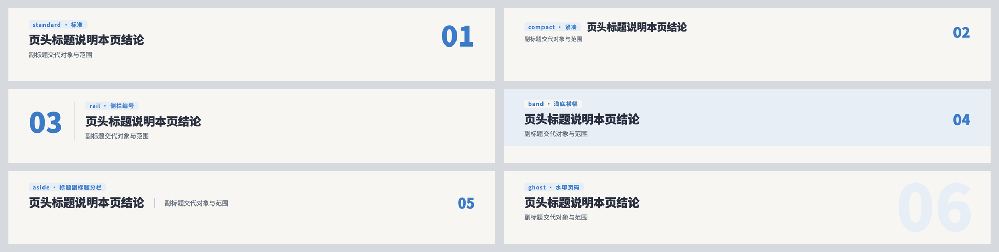
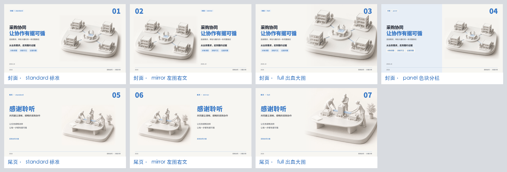
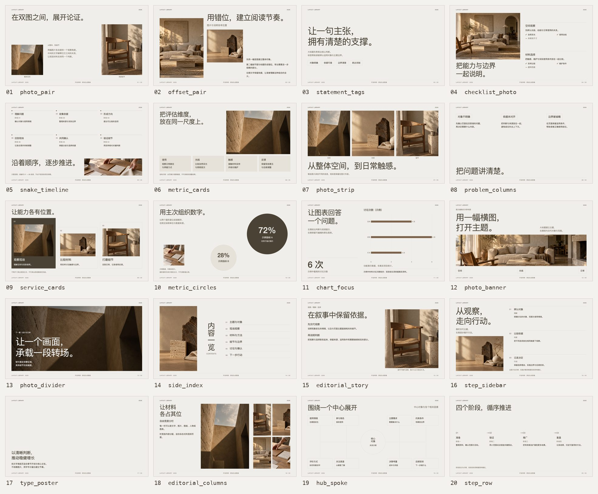

<a id="readme-top"></a>

<div align="center">

<h1>PPT-workbench-skill</h1>

<p><strong>Turn an outline into a polished, editable slide deck.</strong></p>
<p>Nine visual styles · Live or self-guided reading · One offline HTML file</p>

<p><strong>English</strong> · <a href="README.zh-CN.md">简体中文</a></p>

<p>
  <a href="#quick-start">Quick start</a> ·
  <a href="#visual-styles">Visual styles</a> ·
  <a href="#presentation-modes">Presentation modes</a> ·
  <a href="#layout-library-and-automatic-selection">Layouts</a> ·
  <a href="#build-from-the-command-line">Build</a> ·
  <a href="#present-edit-and-export">Present &amp; export</a>
</p>

<p><code>Codex / Claude Code</code> &nbsp; <code>Toolkit v3.7.0</code> &nbsp; <a href="LICENSE">MIT License</a></p>

</div>

---

Give your agent an outline, pick a visual style and a presentation mode, and get back a finished deck: illustrations, charts, and layouts chosen to fit each page. Start with [`ppt-workbench`](skills/ppt-workbench/SKILL.md). Each style owns its theme, illustration prompts, and references; all styles share one toolkit for layouts, charts, editing, and export.

| One consistent look | Content that fits the audience | Nothing to install for viewers |
|---|---|---|
| Covers, type, illustrations, and closings follow a single style. | Concise slides for a live talk, or complete pages for reading alone. | CSS, scripts, images, icons, and charts are embedded; editing, printing, and PPTX export are built in. |

> **Output:** a self-contained `.html` file. Need PowerPoint? Use the player's **Export PPTX** button (or `export_pptx.cjs`) to get an editable `.pptx`, then review it in PowerPoint.

## Visual styles

Three illustrated styles are previewed below; the table that follows lists all nine. Click an image for full size. Business content and chart values are illustrative.

| White & Blue | Navy Glass | Realistic Miniature |
|:---:|:---:|:---:|
| <a href="skills/white-blue-slides/assets/reference-design/approved-open-icons.jpg"></a> | <a href="docs/images/examples/speech-product.png"></a> | <a href="docs/images/examples/miniature-speech-cover.png"></a> |
| Warm white · Bright blue · Matte models | Navy · Glass · Champagne gold | Warm gray · Natural materials · Expressive figures |
| [`white-blue-slides`](skills/white-blue-slides/SKILL.md) | [`navy-glass-slides`](skills/navy-glass-slides/SKILL.md) | [`realistic-miniature-slides`](skills/realistic-miniature-slides/SKILL.md) |

Every style works in both presentation modes. A deck uses one style throughout; what each illustration shows comes from your content.

<details>
<summary><strong>All nine styles, style IDs, and more examples</strong></summary>

| Style | `style` ID | Look |
|---|---|---|
| **[White & Blue](skills/white-blue-slides/SKILL.md)** · 素白蓝调 | `scene-white` | Warm white paper, vivid blue accents, matte white model scenes, and miniature figures. |
| **[Navy Glass](skills/navy-glass-slides/SKILL.md)** · 海蓝玻璃 | `saas-3d` | Warm white paper, navy text and emphasis, muted teal, a touch of champagne gold, and detailed glass displays. |
| **[Realistic Miniature](skills/realistic-miniature-slides/SKILL.md)** · 写实微缩 | `real-miniature` | Warm gray, graphite, gray blue, sage, and a little ochre; 35–45° miniature scenes with realistic materials and expressive figures. Text-free illustrations. |
| **[Monochrome Editorial](skills/monochrome-editorial-slides/SKILL.md)** · 黑白编辑式 | `monochrome-editorial` | Black and white pages, large titles, generous space, and cool editorial photography. |
| **[Warm Minimal Editorial](skills/warm-minimal-editorial-slides/SKILL.md)** · 暖褐极简编辑式 | `warm-minimal-editorial` | Warm cream, deep brown, restrained typography, and warm natural photography. |
| **[Primary Architecture](skills/primary-architecture-slides/SKILL.md)** · 原色建筑编辑式 | `primary-architecture` | White and black, tall condensed titles, offset text columns, architectural photography, and four-color chapter pages. |
| **[Airy Portfolio](skills/airy-portfolio-slides/SKILL.md)** · 留白衬线影集 | `airy-portfolio` | Near-white paper, black serif type, broad margins, and natural-color portfolio photography. |
| **[Beige Ring Business](skills/beige-ring-business-slides/SKILL.md)** · 米白环线商务 | `beige-ring-business` | Warm beige, black sans-serif type, fine rings, and natural business photography. |
| **[Monochrome Marble](skills/monochrome-marble-slides/SKILL.md)** · 黑白大理石商务 | `monochrome-marble` | White and near-black reversals, large serif titles, marble textures, and natural-color business photography. |

| White & Blue · Layered architecture | Navy Glass · Presentation cover |
|:---:|:---:|
| <a href="skills/white-blue-slides/assets/reference-design/approved-architecture.jpg"></a> | <a href="docs/images/examples/speech-cover.png"></a> |

| Realistic Miniature · Reading page | White & Blue · Page reference |
|:---:|:---:|
| <a href="docs/images/examples/miniature-reading-diagonal.png"></a> | <a href="skills/white-blue-slides/assets/reference-design/approved-overview.jpg"></a> |

Illustration references: [Navy Glass product display](skills/navy-glass-slides/assets/reference-design/approved-product-overview.png) · [Realistic Miniature team workspace](skills/realistic-miniature-slides/assets/reference-design/approved-workflow.png).

References set materials, scale, and visual hierarchy. Their business content is never used as fact in a new project.

</details>

## Quick start

### 1. Install the skills

With Node.js/npm available, install straight from this repository with the [Skills CLI](https://github.com/vercel-labs/skills#options).

**Codex**

```bash
npx skills@latest add Johnson-Yrq/ppt-workbench-skill --skill '*' -g -a codex
```

**Claude Code**

```bash
npx skills@latest add Johnson-Yrq/ppt-workbench-skill --skill '*' -g -a claude-code
```

`--skill '*'` installs the workbench and all nine styles (ten packages); keep the quotes. `-g` installs for all projects; drop it to install into the current project only. `-a` picks the agent.

<details>
<summary><strong>List the skills or install manually</strong></summary>

List the skills without installing:

```bash
npx skills@latest add Johnson-Yrq/ppt-workbench-skill --list
```

Or clone the repository and copy the packages:

```bash
git clone https://github.com/Johnson-Yrq/ppt-workbench-skill.git
cd ppt-workbench-skill
```

**Codex**

```bash
mkdir -p ~/.codex/skills
cp -R skills/* ~/.codex/skills/
```

**Claude Code**

```bash
mkdir -p ~/.claude/skills
cp -R skills/* ~/.claude/skills/
```

Keep the ten directories side by side: `white-blue-slides` carries the shared toolkit the other styles depend on, and `ppt-workbench` is the common entry point. Back up existing copies before updating. For White & Blue alone, `white-blue-slides` can be installed by itself.

</details>

### 2. Give your agent an outline

**Let the agent ask for the style and mode:**

```text
Use $ppt-workbench to turn this outline into a slide deck.
Let me choose the visual style and whether it's for a live talk or for reading.
```

**Or say what you want up front:**

```text
Use $ppt-workbench with the Navy Glass style in reading mode.
Use illustrations, processes, matrices, and charts where they fit the content.
```

<details>
<summary><strong>Call a style directly</strong></summary>

```text
Use $white-blue-slides to make a White & Blue deck for a live presentation from this outline.
```

```text
Use $navy-glass-slides to make a Navy Glass deck for independent reading from this proposal.
```

```text
Use $realistic-miniature-slides to make a reading deck from this team collaboration proposal.
Keep the illustrations free of text.
```

</details>

The agent asks only for what is missing and reuses choices already made for the project. Say "you choose" and it picks a direction and explains why. Template defaults never count as your choice, and a new topic does not change an existing deck's style.

### 3. Open, present, and edit

Open the HTML in any modern browser. Present offline, edit text and chart data in place, and click **Save HTML** (`另存 HTML`) to keep your edits. Browser edits do not flow back into `deck.json`.

Skill instructions, reference documents, examples, and player labels are mainly in Chinese.

## Presentation modes

| | Live presentation · `speech` | Independent reading · `reading` |
|---|---|---|
| **Audience** | Follows a speaker. | Reads alone, with no one to explain. |
| **Each page** | One conclusion and a few supporting points; details go in speaker notes. | Conclusion, mechanism, evidence, and limits on the page. |
| **Visuals** | A main scene, key steps, a few labels. | Adds real process steps, comparison dimensions, layers, responsibilities, and charts. |
| **When content grows** | Spread it over more slides. | Continue on a related page instead of shrinking the type. |

The mode sets how much a page must explain on its own, not which layout, image ratio, or font size it uses; every layout is available in both modes. Reading pages gain density from meaningful relationships and evidence, not smaller type or longer paragraphs. Without reliable numbers, use processes, responsibilities, comparisons, or layers rather than inventing metrics.

Both choices are recorded at the root of `deck.json` (a complete deck also needs a title and slides):

```json
{
  "style": "saas-3d",
  "presentation_mode": "reading"
}
```

Older decks without these fields build as White & Blue in speech mode; new decks should record both. See [modes and information density](skills/white-blue-slides/references/presentation-modes.md).

### The `reading` composite layout

One of the shared layouts, `reading`, arranges illustrations and content blocks in four fixed compositions. It is optional and works in either mode; the proportions below apply only when this layout is chosen. They refer to the slide body, excluding the header, footer, and full-width summaries.

| Composition | `composition` | Illustrations | Other content |
|---|---|---|---|
| **Half · Left / right** | `half_lr` | One main image in the left half. | A chart with explanation, or a process with a responsibility matrix. |
| **Half · Top / bottom** | `half_tb` | 1–3 images in the top half. | Two complementary groups, such as a process and a trend. |
| **Half · Diagonal** | `half_diagonal` | One image top left, one bottom right. | One content block in each remaining quadrant. |
| **Quarter · One image** | `quarter` | One image in the top-left quarter. | Three blocks of charts, tables, icons, and text. |

<details>
<summary><strong>Preview the four compositions</strong></summary>

| Half · Left / right | Half · Top / bottom |
|:---:|:---:|
| <a href="docs/images/examples/reading-half-lr.png"></a> | <a href="docs/images/examples/reading-half-tb.png"></a> |

| Half · Diagonal | Quarter · One image |
|:---:|:---:|
| <a href="docs/images/examples/reading-half-diagonal.png"></a> | <a href="docs/images/examples/reading-quarter.png"></a> |

Navy Glass, 1920 × 1080. Chart values are sample data.

</details>

When several images share a page, each should show a different subject, stage, or viewpoint, with consistent colors and materials. See the [complete reading example](skills/navy-glass-slides/assets/deck.reading.example.json).

### Offline, editable charts

Charts are available in both modes: **horizontal bar** for comparing categories, **line** for trends over time, and **donut** or **pie** for parts of a whole. Give every chart a unit and a source, explain the takeaway and its limits next to it, and label sample data as such.

To change the data, click **Edit text** (`编辑文字`) in the player, then open **Edit chart data** (`编辑图表数据`) at the chart's bottom right. Categories, series names, and values update the chart instantly and survive **Save HTML**. Recheck the accompanying conclusion after changing values.

Charts render offline as SVG. Each takes 2–8 categories and 1–3 series of finite, nonnegative values; donut and pie take one series with a positive total. See the [chart reference](skills/white-blue-slides/references/charts.md).

### Headers, covers, and closings

White & Blue, Navy Glass, and Realistic Miniature share six content-page header arrangements. The agent picks one per page from the content without asking, or uses the one you name. The other six styles design their own headers in their themes.



| `header` | Best for |
|---|---|
| `standard` | Regular content pages (default) |
| `compact` | Dense reading pages, tables, architecture |
| `rail` | Chaptered progressions, agendas, step-by-step pages |
| `band` | Chapter openers, key conclusions |
| `aside` | Short titles with longer subtitles |
| `ghost` | Pages with generous white space, tables |

Set `"header": "band"` at the root of `deck.json` for the whole deck; a slide's own `header` overrides it.

The `cover` layout has four left/right arrangements and `closing` has three. The agent picks one to suit the illustration's composition; set `variant` on the slide to choose yourself.



| `variant` | Look |
|---|---|
| `standard` | Copy left, image right (default; the only one with side labels) |
| `mirror` | Image left, copy right |
| `full` | Image bleeds to the top and right edges, fading in on the left |
| `panel` | Copy on a light block on the left; covers only |

## Layout library and automatic selection

You don't need to choose a layout for each page. After reading the outline, the agent works out what each page's content is doing and picks a fitting structure from the shared library. The library has **48 executable profiles** built from 12 basic layouts, 20 shared compositions, and 8 `editorial` variants. Every style can use them; the look still comes from the chosen style.

For each page, the agent narrows the choice in this order:

1. **Content relationship**: is the page a sequence, a comparison, a hierarchy, data, or parallel points? This is a judgment about meaning, not keyword matching.
2. **Item count**: every layout holds a set range, e.g. `snake_timeline` needs 4–8 steps and `metric_circles` takes exactly 2 metrics.
3. **Images and data**: candidates are filtered by the images actually available; chart layouts need real values, units, and sources, and no data is invented to fit a layout.
4. **Text capacity**: the page's text is estimated, candidates over capacity rank lower, and the agent is told to add a section or split the page.
5. **Deck rhythm**: neighbouring pages avoid repeating a composition, as a tie-break only.

[`select_layout.py`](skills/white-blue-slides/scripts/select_layout.py) does the filtering and ranking offline and gives a reason for every rejected candidate. If the post-build check finds overflowing text, `--feedback` excludes the current layout and the page is chosen again.

| Content relationship | Candidate layouts |
|---|---|
| Cover or section opener · `cover` | `cover`, `photo_banner`, `type_poster`, `editorial` |
| Explaining one idea · `explanation` | `split`, `scene`, `photo_pair`, `offset_pair`, `photo_divider`, `editorial_story`, `editorial_columns` |
| Parallel points · `parallel` | `split`, `domains`, `statement_tags`, `problem_columns`, `service_cards`, `hub_spoke` |
| Steps and processes · `sequence` | `journey`, `flow`, `snake_timeline`, `step_sidebar`, `step_row`, `reading` |
| Timelines · `timeline` | `journey`, `snake_timeline`, `step_sidebar`, `step_row` |
| Multi-dimension comparison · `comparison` | `journey`, `table`, `metric_cards`, `metric_circles`, `reading` |
| Hierarchy and architecture · `hierarchy` | `architecture`, `hub_spoke`, `reading` |
| Networks and causes · `network` / `causality` | `relations`; networks can also use `hub_spoke` |
| Charts · `data` | `chart_focus`, `editorial_columns`, `reading` |
| Key figures · `statistics` | `metric_cards`, `metric_circles` |
| Agenda · `agenda` | `domains`, `side_index`, `editorial` |
| Galleries and teams · `gallery` / `team` | `photo_pair`, `photo_strip`, `photo_banner`, `editorial`, `editorial_columns` |

Quotes, contact details, controls, formulas, tables, testimonials, mixed modules, and closings make 22 relationships in all. See the [layout selection guide](skills/white-blue-slides/references/layout-selection.md) for the full rules.

### The 20 shared compositions

<a href="docs/images/layouts/shared-compositions.jpg"></a>

Rendered in Warm Minimal Editorial at 1920 × 1080. Images are original generated scenes; text and numbers are samples.

| # | Composition | Best for | # | Composition | Best for |
|---|---|---|---|---|---|
| 01 | `photo_pair` | Two views framing one argument | 11 | `chart_focus` | One takeaway beside one chart |
| 02 | `offset_pair` | Overview to detail, staggered | 12 | `photo_banner` | Openers, quotes, and showcases |
| 03 | `statement_tags` | One claim with 2–6 tags | 13 | `photo_divider` | Section breaks |
| 04 | `checklist_photo` | Capabilities and limits as grouped checklists | 14 | `side_index` | Contents of 2–12 items |
| 05 | `snake_timeline` | Long processes of 4–8 steps | 15 | `editorial_story` | Narrative, testimonials, contact |
| 06 | `metric_cards` | 2–4 metrics or comparison dimensions | 16 | `step_sidebar` | Methods of 2–4 steps |
| 07 | `photo_strip` | A strip of 2–5 images | 17 | `type_poster` | Image-free openers, claims, closings |
| 08 | `problem_columns` | 2–3 parallel problems | 18 | `editorial_columns` | Mixed columns of text, images, people, charts |
| 09 | `service_cards` | Three services with one lead | 19 | `hub_spoke` | A center with 4–8 related factors |
| 10 | `metric_circles` | Two metrics, primary and secondary | 20 | `step_row` | 2–6 steps or phases in a row |

`editorial` adds eight variants: cover, intro, contents, about, services, process, portfolio, and closing. Fields and capacities for each composition are in the [shared composition reference](skills/white-blue-slides/references/shared-layouts.md).

### Basic layouts

Most basic layouts are built around one main illustration; `table` can go without.

| Layout | Purpose | Layout | Purpose |
|---|---|---|---|
| `cover` | Cover | `architecture` | Layered architecture with direct labels |
| `scene` | A main scene with notes on both sides | `flow` | Steps and control points |
| `split` | Two-sided explanations or three-part controls | `domains` | Multiple domain lists |
| `journey` | Stages, comparisons, or paths | `formula` | Factors and how they combine |
| `table` | Tables and boundary comparisons | `relations` | Entities and connections |
| `closing` | An illustrated closing slide | `reading` | [The four composite compositions](#the-reading-composite-layout) |

## Workflow and illustrations

**Choose style and mode → Read the outline → Choose a layout per page → Write `deck.json` → Prepare images → Build → Deliver the HTML**

The agent chooses layouts on its own from each page's content relationships, item counts, images, and data (see [Layout library and automatic selection](#layout-library-and-automatic-selection)). By default you review the finished deck and export PPTX or PDF yourself; ask the agent if you want it to inspect slides or export for you.

| Images available | What happens |
|---|---|
| **Your own images** | The agent reuses them and checks that each matches its slide. |
| **A built-in image tool** | The agent generates an illustration for every suitable page from per-slide briefs, reviews it, and refines it before building. |
| **No built-in tool, but you have an image API** | The agent walks you through configuring the provider, base URL, model, and key in your own terminal; a script then generates every missing image. The key never passes through the chat. |
| **Neither** | The agent exports complete per-slide prompts and an asset checklist, then continues when you supply images, in batches if you like. |

Each missing image needs its own `image.brief`: subjects and counts, actions, relationships, hierarchy, detail, and composition. The exporter flags missing fields and briefs repeated across slides. Titles, real data, explanations, and architecture labels stay in editable content, not in the image.

<details>
<summary><strong>Generate images with your own API in Claude Code and similar tools</strong></summary>

Claude Code, Cursor, and other terminal agents have no built-in image tool. The agent first finishes the slide plan, `deck.json`, and the prompt export, then asks whether to use your own image API. If you agree, it gives you a setup command to run in **your own terminal**. The key is typed without echo and stored in `~/.config/ppt-workbench/image-api.json`, readable only by you; it never appears in the conversation or in project files.

```bash
# OpenAI or an OpenAI-compatible service (replace the base URL and model as needed)
python3 skills/white-blue-slides/scripts/generate_images.py --setup --provider openai --url https://api.openai.com/v1 --model gpt-image-1
```

```bash
# Google Gemini
python3 skills/white-blue-slides/scripts/generate_images.py --setup --provider gemini --model gemini-2.5-flash-image
```

Relay services have presets, for example Right Code: `--setup --preset rightapi --model gpt-image-2.5` (an asynchronous API; the script submits each task and polls for the result). Add `--no-key` if `OPENAI_API_KEY` or `GEMINI_API_KEY` is already set.

The agent then runs `--check` (a free connectivity test), `--dry-run` (a preview that needs no key), `--pages 2` to try one slide, and finally the remaining images. Results use the checklist file names, are padded to the requested ratio with the page's paper color, and are recorded in `image-manifest.json`. Every image is still reviewed: rewrite the brief and rerun with `--force` to regenerate; earlier versions are kept.

Providers: `openai` (the OpenAI Images API and compatible proxies, including `gpt-image-1` and `dall-e-3`) and `gemini` (`gemini-2.5-flash-image` and similar). See [Generating illustrations through an image API](skills/white-blue-slides/references/image-api.md) for fields, request shapes, and limits.

</details>

<details>
<summary><strong>Text inside illustrations, and what to keep</strong></summary>

White & Blue and Realistic Miniature illustrations are text-free by default; Realistic Miniature only supports `ui_text: "none"`, so whiteboards, screens, documents, calendars, and keycaps stay blank. Navy Glass defaults to `ui_text: "demo"`, which allows only **Overview**, **Analytics**, **Activity**, and **Demo** on software screens; it also supports `none`. Charts drawn inside illustrations are decoration, not data.

You receive one standalone `.html` file. Keep `deck.json`, the prompts, and the asset checklist for future edits. A `--draft` build with missing images is only an internal layout preview.

</details>

## Build from the command line

The agent normally runs these steps for you. Run them yourself from the repository root, with `project/` as the deck's working directory:

```text
project/
├── outline.md
├── deck.json
├── images/          # Project illustrations
└── presentation.html
```

### Start from an example

| Example | Contents |
|---|---|
| [White & Blue](skills/white-blue-slides/assets/deck.example.json) | Cover, a scene-based information page, and a closing slide. |
| [Navy Glass · Speech](skills/navy-glass-slides/assets/deck.example.json) | A concise product introduction with subtle emphasis. |
| [Navy Glass · Reading](skills/navy-glass-slides/assets/deck.reading.example.json) | All four `reading` compositions, processes, matrices, and charts. |
| [Realistic Miniature · Speech](skills/realistic-miniature-slides/assets/deck.example.json) | A team workspace, collaboration handoffs, and subtle emphasis. |
| [Realistic Miniature · Reading](skills/realistic-miniature-slides/assets/deck.reading.example.json) | All four `reading` compositions, responsibilities, and sample task charts. |

Each of the other six styles ships `deck.example.json` and `deck.reading.example.json` in its `assets/` folder. Examples include illustration briefs; prepare the images before a final build. Image paths are relative to `deck.json`. See the [deck format reference](skills/white-blue-slides/references/deck-format.md).

### Prepare images and build

```bash
# Export per-slide prompts and an asset checklist (no model or network calls).
python3 skills/white-blue-slides/scripts/prepare_images.py project/deck.json \
  --out project/image-handoff

# Build the self-contained HTML once the images are ready.
python3 skills/white-blue-slides/scripts/build_deck.py project/deck.json \
  --out project/presentation.html
```

The builder stops on structural errors and missing images and names the field to fix.

<details>
<summary><strong>Optional checks</strong></summary>

Run these when you want a review, or when changing the toolkit:

```bash
# Check design decisions and slide structure; images need not exist yet.
python3 skills/white-blue-slides/scripts/build_deck.py project/deck.json \
  --check-plan --out project/design-plan.json

# Render every slide, save screenshots, and report problems.
node skills/white-blue-slides/scripts/audit_deck.cjs project/presentation.html \
  --out project/qa --browser chrome
```

The audit reports text overflow and overlap, missing images, external dependencies, image and content regions, and chart rendering. It does not judge whether an illustration's subject is complete or matches the text; check that by eye.

</details>

<details>
<summary><strong>Build options</strong></summary>

| Tool or option | Purpose |
|---|---|
| `match_paper.py project/images/*.png --deck project/deck.json --dry-run` | Check illustration backgrounds and transparency against the active theme; without `--dry-run`, it corrects mild differences and keeps backups. |
| `--embed-format keep` | Keep original image formats instead of converting to WebP. |
| `--embed-quality 85` | Set image compression quality. |
| `--builder` | Load project-specific layouts built from shared components. |
| `--allow-restyle` | Allow cover, header, or footer changes beyond the chosen theme, only when the user asks for them. |

Older decks build unchanged: `triad` renders as a three-item `split` with the image on the right, and leftover `layout_selection` or `rationale` fields are ignored. Finer controls, such as flow row layouts, architecture leader lines, journey period tags, extra image ratios (`2:1 / 21:9 / 3:1`), and `image.background_mode: white-matte`, are documented in [`deck-format.md`](skills/white-blue-slides/references/deck-format.md).

</details>

## Present, edit, and export

The toolbar offers **Overview · Fullscreen · Speaker notes · Edit text · Save HTML · Export PPTX · Export PDF / Print**. Slides are 1920 × 1080 and scale to fit any window or screen without stretching or cropping; in edit mode, space is reserved for the toolbar. After editing, use **Save HTML**; changes are not written back to `deck.json`.

| Key | Action | Key | Action |
|---|---|---|---|
| `→` / `PageDown` / `Space` | Next slide | `O` | Overview |
| `←` / `PageUp` | Previous slide | `F` | Fullscreen |
| `Home` / `End` | First / last slide | `N` | Speaker notes |
| `Esc` | Close overview, editing, or notes | URL `#3` | Open slide 3 directly |

Keys pressed with Cmd, Ctrl, or Alt go to the browser, so shortcuts such as Cmd+F and Ctrl+P keep working.

### PowerPoint

**Export PPTX** creates an editable PowerPoint file. Headings and body text stay text boxes with their size, weight, color, and spacing; panels, tags, and rules become shapes; illustrations and icons become pictures; charts become native PowerPoint charts with an embedded workbook (**Edit Data** works); speaker notes become slide notes. Positions are measured from the rendered page. One font is used throughout (Microsoft YaHei by default, included with Office on Windows and macOS), so Latin text and digits may run slightly wider. The exporter is embedded in every deck and works offline. The command line does the same, and also handles decks built before the button existed:

```bash
node skills/white-blue-slides/scripts/export_pptx.cjs project/presentation.html \
  --out project/presentation.pptx --browser chrome [--font "PingFang SC"]
```

### PDF and printing

**Export PDF / Print** opens the browser's print dialog. Choose **Save as PDF** and keep the slide size; don't switch to A4 or Letter. Pages are PowerPoint widescreen, **960 × 540 pt (13⅓ × 7.5 in)**. Every chart is rendered before printing, including slides you haven't opened, and printing from fullscreen also gives one slide per page.

For consistent page size and a fit-to-page opening view, use the export script (requires `pdf-lib` as well as Playwright):

```bash
# If you edited the deck in the browser, export the saved HTML.
node skills/white-blue-slides/scripts/export_pdf.cjs project/presentation.html \
  --out project/presentation.pdf --browser chrome
```

<details>
<summary><strong>PDF viewer tips and converting a PDF back to slides</strong></summary>

Some PDF readers ignore the fit-to-page preference; choose **Fit page** manually. On macOS with **Show scroll bars** set to **Always**, Chrome's PDF presentation mode can show a thin strip of the next page. Setting **System Settings → Appearance → Show scroll bars** to **When scrolling**, then reloading the PDF and presenting again, removed it in our tests (this changes scroll bars system-wide). Changing the PDF paper size does not help. Screens that aren't 16:9 keep bars at the sides or top and bottom. When a PDF will be presented, check it in that reader; a working HTML presentation doesn't prove the PDF viewer will behave.

If only the PDF survives, the included converter (Python + Poppler) turns it into an offline HTML slideshow that shows one page at a time with sharp vector outlines. Its text cannot be edited or selected, so keep the PDF and any editable source.

```bash
python3 skills/white-blue-slides/scripts/pdf_to_slides.py project/presentation.pdf \
  --out project/presentation-fullscreen.html
```

</details>

Each HTML file embeds the player it was built with. To pick up player fixes, rebuild from the project, keeping any browser-edited copy first.

## Extend the toolkit

Each style package owns its theme, illustration base prompt, references, and quality rules. Layouts and player features live in the shared scripts and are never copied per style.

List the installed styles:

```bash
python3 skills/white-blue-slides/scripts/style_packs.py --list
```

This finds every valid sibling package and returns its name, ID, description, and skill entry point. A new package appears automatically; the workbench needs no edits.

<details>
<summary><strong>Package structure and adding a style</strong></summary>

Name the package in lowercase, hyphenated English after its look, ending in `-slides`, and match the skill name. The Chinese display name is what the workbench shows.

```text
skills/
├── ppt-workbench/                 # Common entry point
├── white-blue-slides/             # White & Blue + shared toolkit
│   ├── scripts/                  # Build, image handoff, discovery, and checks
│   ├── assets/                   # Components, player, layouts, and charts
│   └── references/               # Deck format, modes, charts, and extension rules
├── navy-glass-slides/             # Independent style package
├── …                              # Other style packages
└── new-style-slides/              # A future style
    ├── SKILL.md
    ├── agents/openai.yaml
    ├── assets/
    │   ├── style.json
    │   ├── theme.css
    │   ├── image-style.txt
    │   └── reference-design/
    └── references/
        ├── design-system.md
        ├── image-workflow.md
        └── quality-check.md
```

In `assets/style.json`, declare `schema: "html-slide-style/v1"`, a unique ID, the style's resources, and its audit contract. Once the sample deck is approved and validated, mark the package `ready` and install it next to the others; the workbench, builder, and image exporter pick it up automatically. New styles get both presentation modes and every shared layout.

```bash
# Include draft packages in development checks (this does not activate them).
python3 skills/white-blue-slides/scripts/style_packs.py --list --include-drafts
```

See [adding an independent style package](skills/white-blue-slides/references/adding-styles.md) for fields, integration steps, and validation.

</details>

### Dependencies and development checks

| Task | Dependencies |
|---|---|
| Build HTML, export prompts, list styles, call an image API | Python 3.9+ standard library |
| WebP compression; padding API images to the requested ratio | Pillow (optional; original formats are kept without it) |
| Match illustration backgrounds | NumPy + Pillow |
| Automated browser checks | Node.js + Playwright + Chrome/Chromium |
| PPTX export from the command line | Playwright + Chrome/Chromium (the toolbar button needs nothing) |
| PDF export (page count and size verified) | Playwright + pdf-lib + Chrome/Chromium |
| Slideshow from an existing PDF | Python + Poppler (`pdfinfo`, `pdftocairo`) |
| Overview contact sheet | Sharp (optional) |

ECharts 5.6.0 is bundled as a trimmed build (bar, line, and pie charts with the SVG renderer, about 550 KB), so no install or CDN is needed. To add a chart type, import it in [`echarts.entry.js`](skills/white-blue-slides/assets/vendor/echarts.entry.js) and rebuild with the command in that file. Image generation comes from your agent environment or your own image API, not from the skills.

After changing scripts or assets, run the self-test:

```bash
python3 skills/white-blue-slides/scripts/selftest.py
```

It covers shared components, both modes, style isolation, style discovery, chart inputs, recovery from missing images, and the image API script (with a fake offline transport). After changing the player, exporters, or a theme, also run `test_player.cjs` on any built deck; it checks navigation, shortcuts, editing, saving, PPTX export, fullscreen fit, and printing. Self-tests don't replace looking at real slides: after theme or layout changes, build with real illustrations and review every page.

## License and assets

Project code is licensed under [MIT](LICENSE). Third-party components keep their own licenses:

- Lucide icons: [MIT license](skills/white-blue-slides/assets/lucide-LICENSE.txt).
- Apache ECharts: [Apache 2.0 license](skills/white-blue-slides/assets/vendor/ECHARTS-LICENSE.txt) and [NOTICE](skills/white-blue-slides/assets/vendor/ECHARTS-NOTICE.txt), also embedded in decks that contain charts.

The kit ships no logo or company name; each deck supplies its own footer branding. Reference images illustrate the styles. Example business content and numbers are not claims about any real product.

---

<p align="center"><a href="README.md">English</a> · <a href="README.zh-CN.md">简体中文</a> · <a href="#readme-top">Back to top ↑</a></p>
